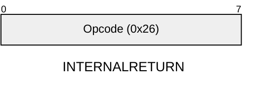

<!-- BEGIN VENDORED-PROVENANCE — generated by `just vendor-headers` (tools/provenance.py); do not hand-edit.
     VENDORED — not our code. Re-vendor rather than editing here.
       upstream-repo:   AztecProtocol/aztec-packages
       upstream-path:   yarn-project/simulator/docs/avm/opcodes/internalreturn.md
       upstream-commit: 233d8e099336c1773b89e939100af047ed9c4f71
       licence:         Apache-2.0
       local-edits:     none
       inventory:       REUSE-INVENTORY.md RI-47
     END VENDORED-PROVENANCE -->

[&larr; Back to Instruction Set: Quick Reference](../avm-isa-quick-reference.md)

# INTERNALRETURN

Return from internal call

Opcode `0x26`

```javascript
PC = internalCallStack.pop().returnPc
```

## Details

Pops return PC from internal call stack and sets PC to it.

## Gas Costs

| Component | Value |
|-----------|-------|
| L2 Base | 9 |
| DA Base | 0 |

\* See [Gas Metering](../gas.md) for details on how gas costs are computed and applied.

## Wire Formats
See [Wire Format](../wire-format.md) page for an explanation of wire format variants and opcode naming (e.g., why `ADD_8` vs `ADD_16`).

**INTERNALRETURN** (Opcode 0x26):



## Error Conditions

- **INTERNAL_CALL_STACK_UNDERFLOW**: Internal call stack is empty

---

[&larr; Back to Instruction Set: Quick Reference](../avm-isa-quick-reference.md)
